# Run GPS Viewer

A single-file, browser-based tool for **visualizing, replaying, and auditing GPS trips** — built with NEMT (Non-Emergency Medical Transport) trip verification in mind, but useful for any GPS track.

Upload a run's GPS JSON and the tool draws the path on a map, lets you replay it with an animated car, place named pickup/dropoff markers, and produce a compliance audit (verification, dwell times, on-time performance, loaded vs. deadhead mileage) — all offline in one HTML file.

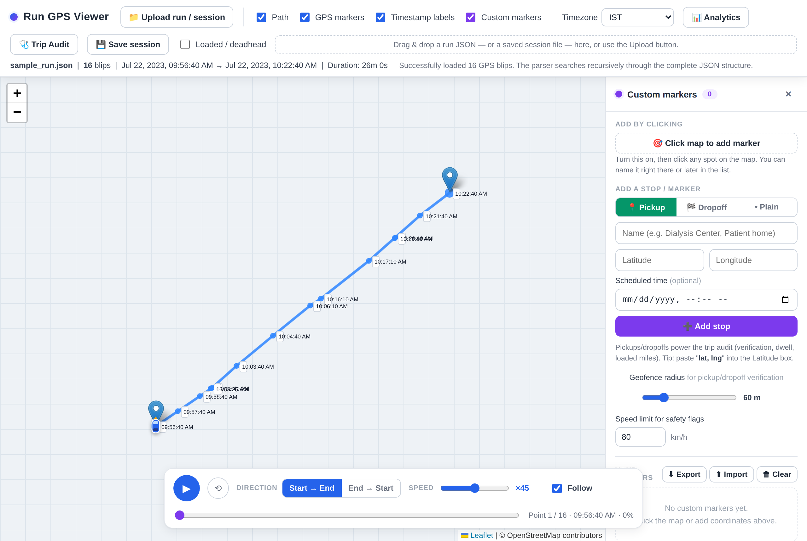
*The main screen: toolbar on top, map in the center, the custom-markers panel on the right, and the playback bar at the bottom.*

---

## Table of contents

1. [Who this is for](#who-this-is-for)
2. [Requirements](#requirements)
3. [Quick start](#quick-start)
4. [The interface at a glance](#the-interface-at-a-glance)
5. [Loading a run](#1-loading-a-run)
6. [Map display toggles & timezone](#2-map-display-toggles--timezone)
7. [Custom markers (pickup / dropoff / plain)](#3-custom-markers-pickup--dropoff--plain)
8. [Geofence & speed-limit settings](#4-geofence--speed-limit-settings)
9. [Car playback animation](#5-car-playback-animation)
10. [Trip Analytics (gaps, distance, speed)](#6-trip-analytics-gaps-distance-speed)
11. [NEMT Trip Audit](#7-nemt-trip-audit)
12. [Loaded vs. deadhead coloring](#8-loaded-vs-deadhead-coloring)
13. [Save & restore a session](#9-save--restore-a-session)
14. [How loaded-mile inference works](#how-loaded-mile-inference-works)
15. [Data formats](#data-formats)
16. [Troubleshooting & FAQ](#troubleshooting--faq)
17. [What's in this project](#whats-in-this-project)
18. [Credits & open-source licenses](#credits--open-source-licenses)

---

## Who this is for

- **Dispatchers / operations** who want to see how a driver actually followed a route.
- **Billing & compliance teams** who need to prove a vehicle reached each pickup and dropoff and measure billable (loaded) mileage.
- **Engineers** debugging GPS quality (gaps, jitter, teleports) — the analytics export is designed to be read by an AI assistant alongside your codebase.

No installation, no server, no account. Everything runs in your browser.

---

## Requirements

- A modern web browser (Chrome, Edge, Firefox, or Safari).
- **An internet connection** — the map tiles (OpenStreetMap) and two small libraries (Leaflet for the map, Chart.js for the charts) load from the web the first time you open the page. Everything else runs locally; your GPS data never leaves your browser.

> The screenshots in this guide were captured offline, so the map appears as a plain grid. In normal use you'll see real street maps behind the path and markers.

---

## Quick start

1. Double-click **`index.html`** to open it in your browser.
2. Click **📁 Upload run / session** (top-left) and choose **`samples/sample_run.json`** from the project folder.
3. The trip appears on the map. Press **▶** in the bottom bar to watch the car drive the route.
4. Want the full NEMT demo? Click **⬆ Import** in the right panel and choose **`samples/sample_markers.json`** — this drops a pickup, a dropoff, and a depot marker. Then click **🩺 Trip Audit**.

That's the whole loop: **load → visualize → mark stops → audit**.

---

## The interface at a glance

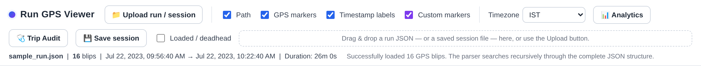

| Control | What it does |
| --- | --- |
| **📁 Upload run / session** | Load a GPS run JSON, or a previously saved session file (auto-detected). |
| **Path / GPS markers / Timestamp labels / Custom markers** | Show or hide each map layer. |
| **Timezone** | Display all times in IST, UTC, or your browser's local zone. |
| **📊 Analytics** | Open gap / distance / speed charts (enabled once a run is loaded). |
| **🩺 Trip Audit** | Open the NEMT audit panel (verification, dwell, mileage, on-time). |
| **💾 Save session** | Download the whole working state as one file to reload later. |
| **Loaded / deadhead** | Recolor the path by whether a passenger was aboard. |

---

## 1. Loading a run

When you first open the tool, the map is empty and waiting for data.

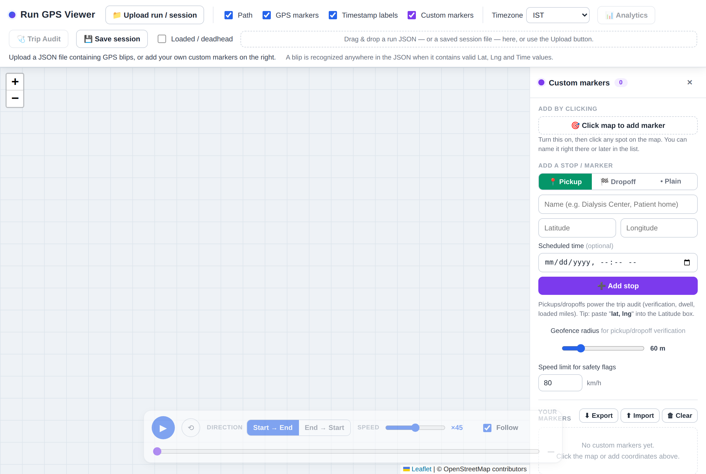

**To load a trip:**

1. Click **📁 Upload run / session** and pick your run's `.json` file — **or** drag the file onto the dashed drop zone in the toolbar.
2. The tool parses the file, draws the route as a blue line, and places a marker at each GPS point ("blip").
3. The summary line under the toolbar confirms the filename, blip count, start/end time, and duration.

**What counts as a valid trip file?** The parser searches the *entire* JSON structure (no matter how it's nested) and treats any object containing a latitude, longitude, and time value as a GPS blip. It recognizes many field-name spellings — `Lat`/`lat`/`latitude`, `Lng`/`lon`/`longitude`, `Time`/`timestamp`/`createdAt`, etc. — and both Unix seconds and milliseconds. See [Data formats](#data-formats) for details.

If no valid blips are found, an error message explains what was missing.

---

## 2. Map display toggles & timezone

Four checkboxes in the toolbar control what's drawn on the map:

- **Path** — the connecting line between blips.
- **GPS markers** — a dot at each blip; click one for full details (time, coordinates, accuracy, speed, booking/status IDs, and where it was found in the JSON).
- **Timestamp labels** — a small time tag next to each blip.
- **Custom markers** — your placed pickup/dropoff/plain markers and their geofence circles.

The **Timezone** dropdown re-formats every time shown in the tool (labels, popups, analytics, audit) between **IST**, **UTC**, and **Browser local**. Switch it any time — the map updates instantly.

The larger dots on the route are the **START** and **END** points; click them for a summary popup.

---

## 3. Custom markers (pickup / dropoff / plain)

The right-hand **Custom markers** panel is where you annotate the trip. Markers come in three types:

- **📍 Pickup** — green pin marked **P**.
- **🏁 Dropoff** — red pin marked **D**.
- **• Plain** — a general-purpose marker in any color (depot, landmark, note).

Pickups and dropoffs are what power the [Trip Audit](#7-nemt-trip-audit) and [loaded-mile inference](#how-loaded-mile-inference-works). You can add as many of each as you like.

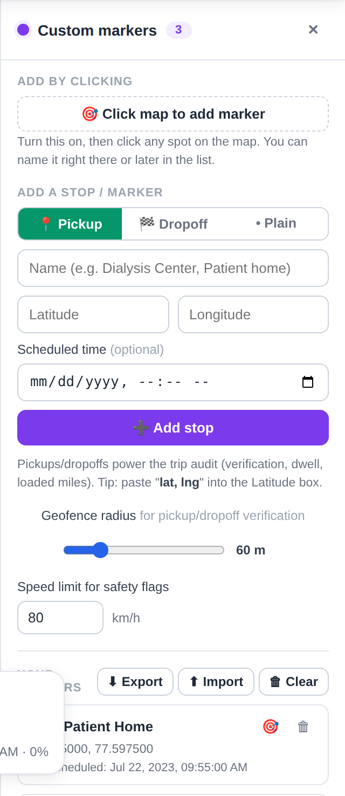
*Pickup mode shows an optional Scheduled-time field used for on-time performance.*

There are three ways to place one: by **address**, by **coordinates**, or by **clicking the map**.

### Adding a marker by address

Use this when you know where the stop is but not its latitude and longitude.

1. Choose the type (**Pickup / Dropoff / Plain**).
2. Optionally type a **Name**. If you leave it blank, the place name from the search result is used.
3. Type the address or place into **Search an address or place…** — for example `Apollo Hospital Bannerghatta Road Bangalore`.
4. Press **Enter** or click **🔍**. Up to five matches appear beneath the box, each showing the place name and its full address.
5. Click the right match. The map jumps to it and the **Latitude** / **Longitude** fields fill in, so you can confirm the pin lands where you expect.
6. Click **➕ Add stop**.

You can also skip the picking step: type an address, leave the coordinate fields empty, and click **➕ Add stop** directly. If exactly one place matches it is added straight away; if several do, the matches are listed so you can choose.

The lookup uses [OpenStreetMap's Nominatim geocoder](https://nominatim.openstreetmap.org/), so it needs internet. If it is unreachable the panel says so and the coordinate fields keep working. A few notes:

- Searches run only when you ask for one — on **Enter**, the **🔍** button, or **Add stop** — never as you type. This keeps the tool inside [Nominatim's usage policy](https://operations.osmfoundation.org/policies/nominatim/), which allows at most one request per second and no bulk querying.
- Repeated searches for the same text are answered from an in-memory cache.
- The address text you search **is sent to Nominatim** — it is the one thing the tool transmits. See [the FAQ](#troubleshooting--faq).
- A fuller address gives better results. If nothing matches, add the city or postcode.

### Adding a marker by coordinates

1. Choose the type (**Pickup / Dropoff / Plain**) at the top of the form.
2. Type a **Name** (e.g. "Dialysis Center").
3. Enter **Latitude** and **Longitude**. *Tip: you can paste `12.9650, 77.5975` straight into the Latitude box — it splits automatically.*
4. For pickups/dropoffs, optionally set a **Scheduled time** (used to compute early/late).
5. Click **➕ Add stop**.

If a coordinate field has anything in it, coordinates take priority over the address box.

### Adding a marker by clicking the map

1. Click **🎯 Click map to add marker**.
2. Click anywhere on the map — a pin of the currently selected type drops there.
3. Name it in the popup or later in the list. Keep clicking to add more; click **Done** (or the toggle again) to stop.

### Plain markers & colors

Switch the type to **• Plain** and a color palette appears — pick a preset or use the custom color picker. Each plain marker in the list has a color swatch you can click to recolor it any time.

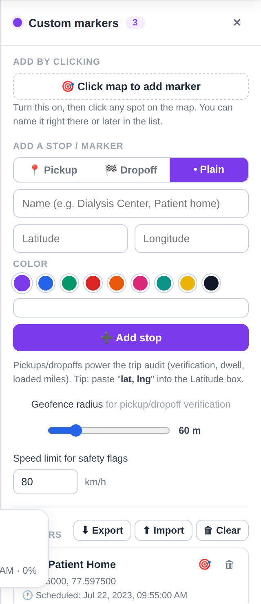

### Managing markers

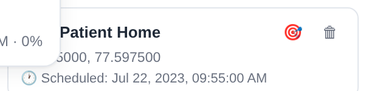

Every marker appears in **Your markers**. For each one you can:

- **Rename** — click the name and type.
- **Recolor** (plain only) — click the swatch.
- **Zoom to it** — click the 🎯 icon.
- **Delete** — click the 🗑 icon.
- **Drag** the pin on the map to fine-tune its position.

Use **⬇ Export** / **⬆ Import** to save the marker set to a JSON file and reload it on another run, and **🗑 Clear** to remove all markers.

---

## 4. Geofence & speed-limit settings

Two settings in the sidebar tune the audit:

- **Geofence radius** — the distance (20–500 m) around each pickup/dropoff within which the vehicle counts as "reached" the stop. A faint circle is drawn around each pickup/dropoff so you can see the zone. Tighten it for strict verification; widen it for large facilities or noisy GPS.
- **Speed limit for safety flags** — segments faster than this (default 80 km/h) are flagged in the audit.

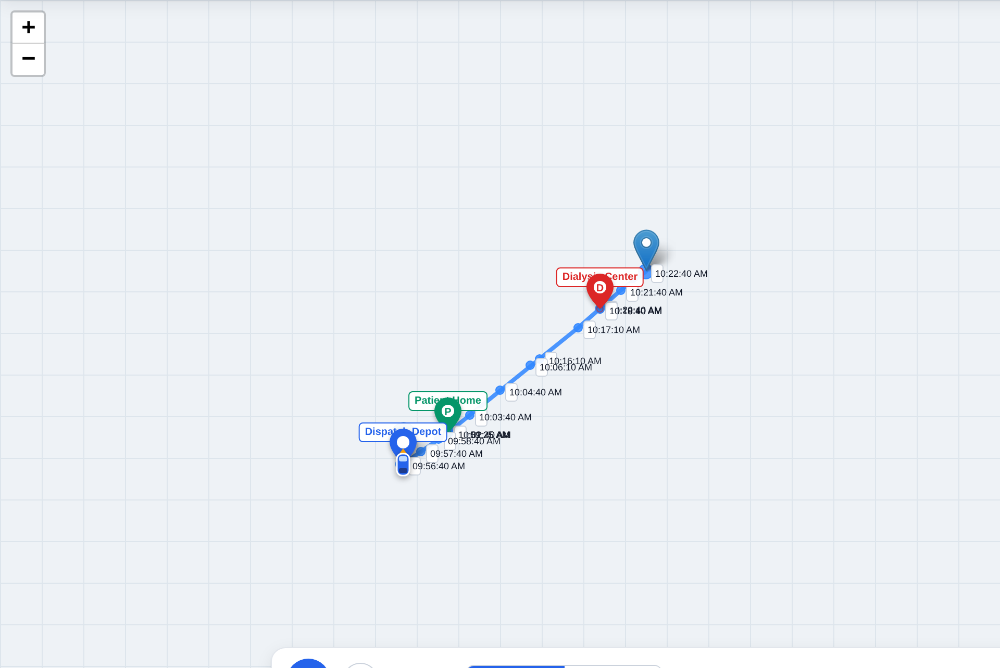
*A green **P** pickup and red **D** dropoff (each ringed by its geofence) alongside a blue plain "Dispatch Depot" marker.*

---

## 5. Car playback animation

The bar at the bottom of the map replays the trip with a car that follows the exact path.

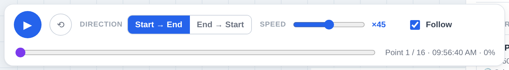

- **▶ / ⏸** — play or pause. The car moves using the **real timestamps**, so it lingers where the driver waited and speeds up where they drove fast — you see how the trip actually unfolded.
- **⟲ Reset** — send the car back to the start of the current direction.
- **Direction** — **Start → End** or **End → Start**.
- **Speed** — how fast playback runs relative to real time (e.g. ×45). Drag to taste.
- **Scrubber** — drag to jump to any moment; the readout shows the point number, timestamp, and percent complete.
- **Follow** — when ticked (default), the map keeps the car centered at whatever zoom you've set so it never leaves the view. Untick it to pan around freely while playback continues.

---

## 6. Trip Analytics (gaps, distance, speed)

Click **📊 Analytics** for a statistical view of the gaps between blips — useful for spotting reporting gaps and GPS quality issues.

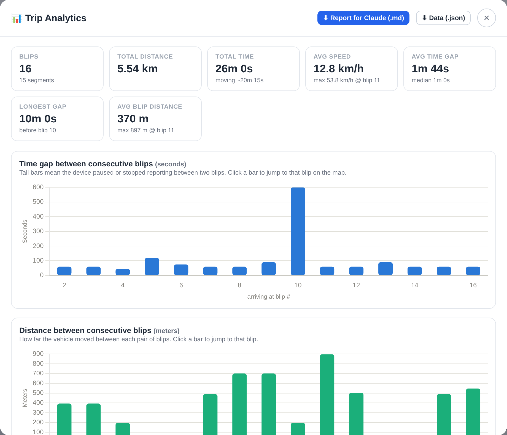

At the top are summary tiles (total distance, duration, average/max speed, average/median/longest time gap, etc.). Below are three interactive charts:

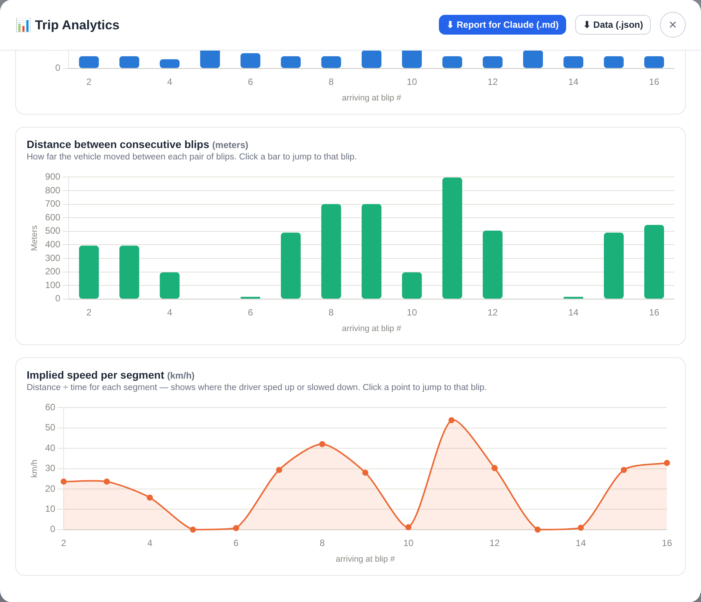

- **Time gap between blips** — tall bars mean the device paused or stopped reporting.
- **Distance between blips** — how far the vehicle moved each step.
- **Implied speed per segment** — where the driver sped up or slowed down.

**Click any bar or point** to close the panel and jump the map to that blip.

**Exports (top of the panel):**

- **⬇ Report for Claude (.md)** — a Markdown report with an analysis brief, the detected anomalies (large gaps, over-sampling, implausible speed, stationary drift, duplicate timestamps, low accuracy), a code-review recommendation for each, and the full data embedded as JSON. Designed to hand to an AI assistant alongside the source code that produces these GPS points.
- **⬇ Data (.json)** — the raw analysis data.

---

## 7. NEMT Trip Audit

Click **🩺 Trip Audit** for the compliance view. It combines your pickup/dropoff markers with the GPS track to answer the questions a NEMT trip gets audited on.

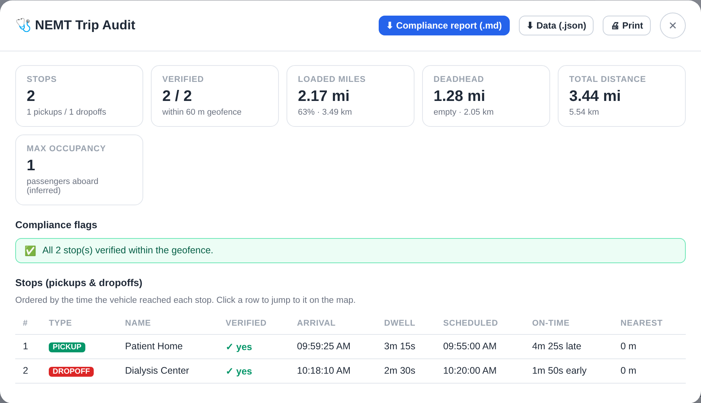

**Summary tiles:** number of stops, how many were **verified** (the vehicle came within the geofence), **loaded (billable) miles**, **deadhead** (empty) miles, total distance, and the inferred maximum passengers aboard.

**Compliance flags** call out problems automatically, for example:

- a stop the vehicle **never reached** within the geofence (possible undocumented/"ghost" stop or GPS dropout),
- **GPS gaps** while parked at a stop,
- **unbalanced** pickups vs. dropoffs,
- **speeding** segments.

**Stops table** — one row per pickup/dropoff, ordered by arrival, showing: type, name, verified (✓/✗), **arrival time**, **dwell time** (how long parked there), **scheduled** time, **on-time** (early/late), and nearest approach distance. **Click a row** to jump to that stop on the map.

**Exports (top of the panel):**

- **⬇ Compliance report (.md)** — a shareable Markdown report (billing/audit brief, loaded-mile summary, flags, stops table, embedded JSON).
- **⬇ Data (.json)** — the audit data on its own.
- **🖨 Print** — opens a clean printable view; use your browser's "Save as PDF" to file it.

---

## 8. Loaded vs. deadhead coloring

Tick **Loaded / deadhead** in the toolbar to recolor the route by whether a passenger was aboard.

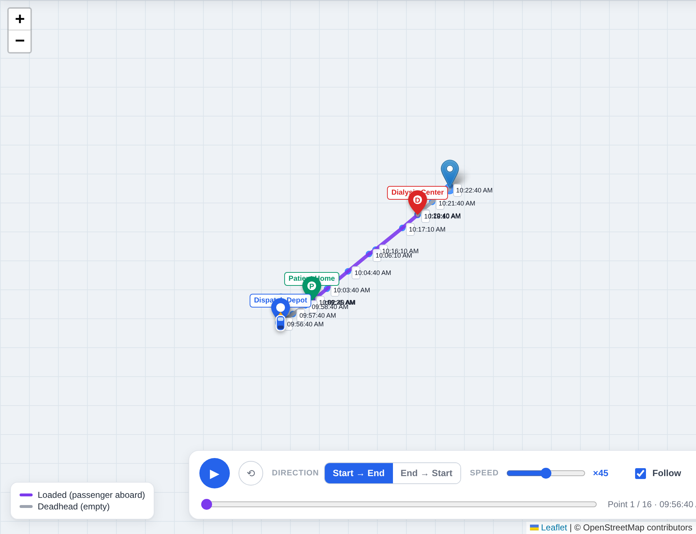

- **Purple** = loaded (passenger aboard) — the billable portion.
- **Gray** = deadhead (empty vehicle).

A legend appears at the bottom-left. This is derived from the order in which the vehicle reached your pickup/dropoff markers — see below.

---

## 9. Save & restore a session

Set everything up once, then save it as a single file to reopen later or hand to a colleague.

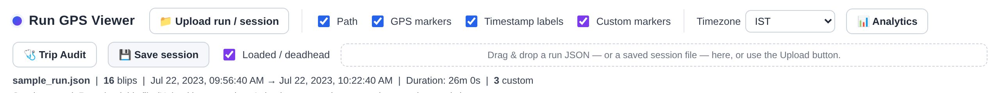

1. Load a run, place your markers, and adjust settings/view as you like.
2. Click **💾 Save session** — a `gps_session_*.json` file downloads. It contains the run, all markers (with types and scheduled times), every setting (timezone, geofence, speed limit, layer toggles), and the current map center/zoom.
3. To restore, just **upload that file** with the same **📁 Upload run / session** button (or drag-and-drop). The tool detects it's a session and rebuilds everything exactly as you left it.

Anything else you upload is still treated as a normal run file, so one button handles both.

---

## How loaded-mile inference works

The tool has **no access to trip-status data** — it only knows the GPS track and the pickup/dropoff markers you place. It reconstructs "who was aboard when" purely from geometry:

1. For each pickup/dropoff, it finds where the track comes **closest** and whether that's within the **geofence radius**. If so, it records the **arrival** and **departure** times (the contiguous stretch inside the circle) and the **dwell**.
2. It orders those stop visits by time and runs an **occupancy count**: each pickup **+1** passenger (from when the vehicle *leaves* the pickup), each dropoff **−1** (when it *arrives* at the dropoff).
3. Any distance covered while occupancy **> 0** is **loaded (billable)**; occupancy **0** is **deadhead**.

> **Accuracy note:** because this is inferred from geometry, it's correct as long as your markers are placed accurately and the vehicle genuinely visited them in a sensible order. If a dropoff appears before any pickup, the tool clamps occupancy at zero and raises a flag. On-time performance uses the scheduled time you enter, compared against the geofence arrival time. Every exported report states this inference note explicitly.

---

## Data formats

### Run JSON (input)

The parser is deliberately forgiving: it walks the whole structure and picks up any object with latitude, longitude, and time. A minimal blip looks like:

```json
{ "Lat": 12.9650, "Lng": 77.5975, "Time": 1690000165, "Accuracy": 6 }
```

- **Latitude:** `Lat`, `lat`, `latitude`, `Latitude`
- **Longitude:** `Lng`, `lng`, `Lon`, `lon`, `Long`, `longitude`
- **Time:** `Time`, `time`, `timestamp`, `createdAt`, … (Unix **seconds** or **milliseconds**)
- **Optional, shown in popups:** `Accuracy`, `Speed`, `Distance`, `Bearing`, `StatusId`, and `Bookings[]` / `BookingIds[]`.

See **`samples/sample_run.json`** for a complete example.

### Markers JSON (export/import)

```json
[
  { "name": "Patient Home", "lat": 12.9650, "lng": 77.5975,
    "color": "#059669", "kind": "pickup",
    "scheduledIso": "2023-07-22T04:25:00.000Z" }
]
```

`kind` is `"pickup"`, `"dropoff"`, or `"plain"`. `scheduledIso` may be `null`. See **`samples/sample_markers.json`**.

### Session JSON

A superset that bundles `settings`, `run` (filename + points), and `markers`, tagged with `"__type": "run-gps-viewer-session"` so the uploader recognizes it. See **`samples/sample_session.json`**.

---

## Troubleshooting & FAQ

**The map is blank / gray.**
The map tiles need internet. Check your connection and reload. The path and markers still work offline; only the street imagery needs the network.

**"No valid GPS blips were found."**
The file didn't contain objects with a recognizable latitude, longitude, and time. Confirm the field names and that timestamps are numeric (Unix seconds or milliseconds).

**Charts don't appear in Analytics.**
The Chart.js library couldn't load (no internet). The summary numbers are still accurate; reconnect and reopen.

**Trip Audit / Analytics buttons are greyed out.**
They enable once a run with at least two points is loaded.

**On-time shows a huge number.**
The scheduled time you entered is in a very different timezone from the trip. Set the **Timezone** dropdown to match how you entered the schedule, or re-enter the scheduled time.

**Loaded miles look wrong.**
Check that each pickup/dropoff marker sits on the actual stop and within the geofence radius, and that pickups and dropoffs are balanced. Widen the geofence if a stop shows as unverified.

**Does my data leave my computer?**
Your GPS data does not. Parsing, analytics, and the audit all run in your browser, and no run file, marker set, or session is ever uploaded.

Three things do go over the network: map tiles are fetched from OpenStreetMap, the JavaScript libraries are fetched from their CDNs, and — only when you run an address search — the text you typed into the search box is sent to OpenStreetMap's Nominatim service. Coordinates you type by hand are never sent anywhere. If you avoid the address search, nothing about your trip leaves the browser.

**Address search returns nothing, or says it is unavailable.**
It needs internet, so check the connection first. Otherwise try a fuller address with a city or postcode — Nominatim matches on OpenStreetMap data, which covers some areas better than others. If searching stays unavailable, the request may have been rate-limited: wait a moment and try once more, or enter the latitude and longitude directly.

---

## What's in this project

```
run-gps-viewer-docs/
├── index.html                ← the tool (open this)
├── README.md                 ← this guide
├── images/                   ← screenshots used in this guide
└── samples/
    ├── sample_run.json       ← a demo NEMT trip (16 blips)
    ├── sample_markers.json   ← pickup + dropoff + depot markers
    └── sample_session.json   ← a full saved session (run + markers + settings)
```

---

## Credits & open-source licenses

This tool is a single HTML file with no build step, and it stands entirely on open-source work. Nothing here is vendored — every library is loaded from a public CDN at runtime — so the versions below are the ones the file actually requests.

### Map data & services

**[OpenStreetMap](https://www.openstreetmap.org/)** — © OpenStreetMap contributors. Everything geographic in this tool comes from the OSM project.

| Used for | Service | Terms |
| --- | --- | --- |
| Street map imagery behind the path | [OSM standard tile layer](https://tile.openstreetmap.org/) | Map data under the [Open Database License (ODbL) 1.0](https://opendatacommons.org/licenses/odbl/); tiles under [CC BY-SA 2.0](https://creativecommons.org/licenses/by-sa/2.0/), subject to the [Tile Usage Policy](https://operations.osmfoundation.org/policies/tiles/) |
| Address → coordinate lookup in the marker panel | [Nominatim](https://nominatim.openstreetmap.org/) | Data under [ODbL 1.0](https://opendatacommons.org/licenses/odbl/); the Nominatim software is GPL-2.0; use is subject to the [Nominatim Usage Policy](https://operations.osmfoundation.org/policies/nominatim/) |

Both are run as a public service by the [OpenStreetMap Foundation](https://osmfoundation.org/) and paid for by donations. They are not built for heavy or commercial traffic. This tool keeps its footprint small on purpose — searches fire only on an explicit action, are spaced at least a second apart, allow one request at a time, and are cached — but if you deploy it to a team or automate it, please [set up your own Nominatim instance](https://nominatim.org/release-docs/latest/admin/Installation/) or use a commercial geocoder, and consider [donating to the OSMF](https://supporting.openstreetmap.org/).

### JavaScript libraries

| Library | Version | License | Used for |
| --- | --- | --- | --- |
| [Leaflet](https://leafletjs.com/) | 1.9.4 | [BSD-2-Clause](https://github.com/Leaflet/Leaflet/blob/main/LICENSE) | The map, tile layer, markers, polylines, and popups |
| [Chart.js](https://www.chartjs.org/) | 4.4.1 | [MIT](https://github.com/chartjs/Chart.js/blob/master/LICENSE.md) | The speed and gap charts in Trip Analytics |
| [chartjs-plugin-zoom](https://www.chartjs.org/chartjs-plugin-zoom/latest/) | 2.0.1 | [MIT](https://github.com/chartjs/chartjs-plugin-zoom/blob/master/LICENSE.md) | Pan and zoom on those charts |
| [Hammer.js](https://hammerjs.github.io/) | 2.0.8 | [MIT](https://github.com/hammerjs/hammer.js/blob/master/LICENSE.md) | Touch gestures the zoom plugin needs on mobile |

Delivered by two free CDNs: [unpkg](https://unpkg.com/) (Leaflet) and [cdnjs](https://cdnjs.com/), run by [Cloudflare](https://www.cloudflare.com/) (the rest).

### Attribution when you reuse this

The OpenStreetMap credit in the bottom-right of the map is required by the ODbL — please leave it in place. If you fork this tool or embed it elsewhere, keep that attribution visible and credit OpenStreetMap contributors wherever the map or address search appears.

---

*Generated documentation for the Run GPS Viewer tool. The tool is a single self-contained HTML file — no build step, no dependencies to install.*
